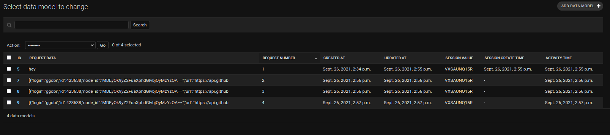
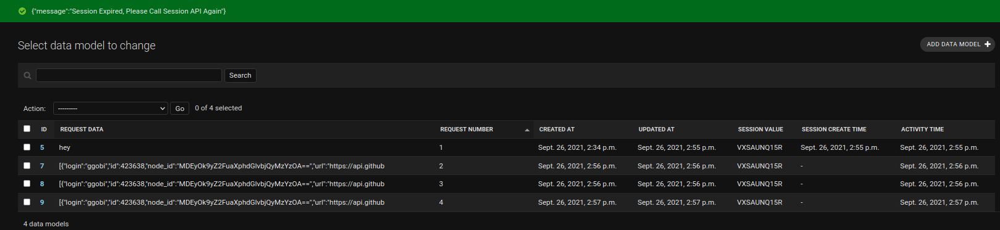

<h1 align="center">Django Authentication</h1>

<p align="center">Django does authentication through sessions, tokens. We implemented session 
as well as jwt token. We need to achieve all the below mentioned tasks.</p>

<ul>

1. DRF with authentication JWT auth based application. 
   1. Register with 5 field. 
   2. first name 
   3. last name 
   4. email 
   5. gender 
   6. city 
   7. state 
   8. username 
   9. password 

2. login JWT token -> expiry : 1 hour

3. logout the user if the user is not active since last 10 minute.
</ul>

## Links 👐

Some Resources to learn more about django sessions and JWT authentication on the go

- [Tutorial Point](https://www.tutorialspoint.com/django/django_sessions.htm "Learn")

- [Django Session Repo](https://github.com/karamdeeps/DjangoSession/tree/main "Live View")

- [Bugs In Project](https://github.com/karamdeeps/Authentications/issues "Issues Page")


## Screenshots For Session Expiry 🤳





## How To! 🦹🏻

In the project directory, you can run:
```
    # This command will create the db, you just have to provide the password
    python manage.py createdb
    
    # This will create the schema files inside migration folder
    python manage.py makemigrations
    
    # This command will execute all the changes in db
    python manage.py migrate
    
    # Run the server to check if everything works fine or not
    python manage.py runserver 
```

## Built With 🤖

- Python
- Django


## Author 🧐

* **Karamdeep Singh**
  * [Profile](https://github.com/karamdeeps "Karamdeeps")
  * [Email](mailto:karamdeepsinghk.ksk@gmail.com?subject=Query "Questions!")
  * [LinkedIn](https://www.linkedin.com/in/karamdeep-singh-a0908b104/ "LinkedIn")
  * [StackOverFlow](https://stackoverflow.com/users/7357716/karamdeep-singh?tab=profile "StackOverFlow")

## 🤝 Support

Contributions, issues, and feature requests are welcome!

Give a ⭐️ if you like this project!
